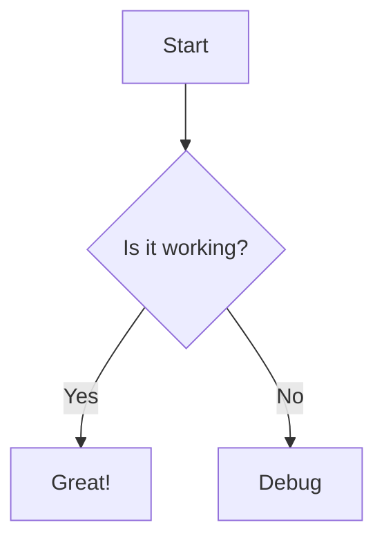

# Markdown to HTML Converter

A Python package that converts Markdown files to HTML with support for Mermaid diagrams.

## Features

- Convert Markdown to HTML with proper styling
- Support for Mermaid diagrams
- Automatic installation of required dependencies
- Command-line interface
- Custom output directory support

## Installation

```bash
pip install markdown-to-html
```

## Prerequisites

This package requires `mermaid-cli` for rendering Mermaid diagrams. If not installed, the converter will attempt to install it automatically via npm:

```bash
npm install -g @mermaid-js/mermaid-cli
```

## Usage

### Command Line Interface

Basic usage of the `md2html` command:

```bash
# Convert a single markdown file
md2html input.md

# Specify custom output directory
md2html input.md --output-dir custom_directory
```

Available Options:
- `--output-dir`: Specify output directory for HTML files (default: 'output')
- `--help`: Show help message

### Python API

```python
from md2html.converter import MarkdownConverter

# Initialize converter
converter = MarkdownConverter('input.md', output_dir='custom_output')

# Convert markdown to HTML
output_file = converter.process_markdown()
print(f"Generated HTML file: {output_file}")
```

## Examples

### Basic Markdown Features

```markdown
# Document Title

This is a paragraph with **bold** and *italic* text.

## Lists

* Item 1
* Item 2
* Item 3
    * Item 3a
    * Item 3b
    * Item 3c
```

Result:
# Document Title

This is a paragraph with **bold** and *italic* text.

## Lists

* Item 1
* Item 2
* Item 3
    * Item 3a
    * Item 3b
    * Item 3c

### Tables

```markdown
| Header 1 | Header 2 |
|----------|----------|
| Cell 1   | Cell 2   |
| Cell 3   | Cell 4   |
```

Result:

| Header 1 | Header 2 |
|----------|----------|
| Cell 1   | Cell 2   |
| Cell 3   | Cell 4   |


### Mermaid Diagrams

The converter automatically processes Mermaid diagram blocks:

```markdown

```

### Code Blocks

```
def hello_world():
    print("Hello, World!")
```

## Supported Markdown Features

- Headers (H1-H6)
- Bold and italic text
- Lists (ordered and unordered)
- Code blocks with syntax highlighting
- Tables
- Mermaid diagrams
- Line breaks
- Fenced code blocks

## License

This project is licensed under the MIT License - see the [LICENSE](LICENSE) file for details.